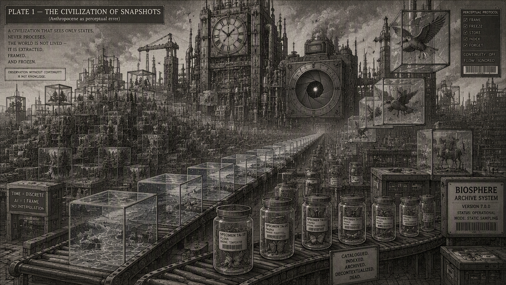
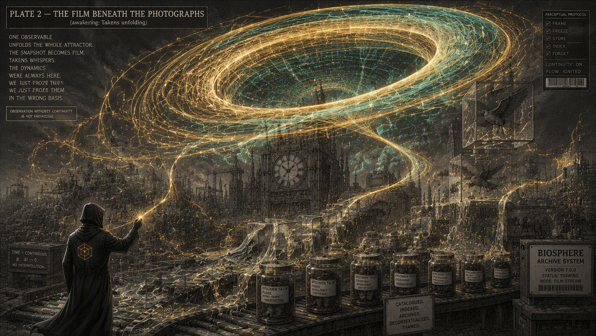
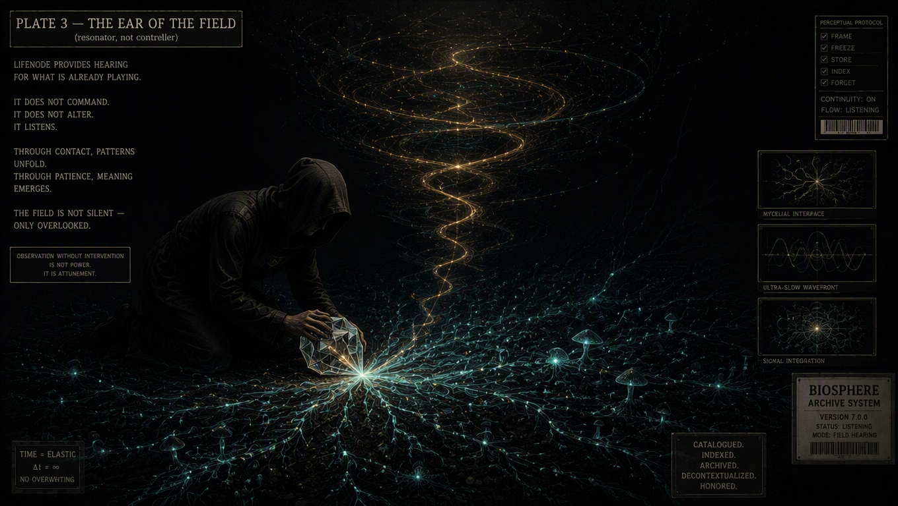
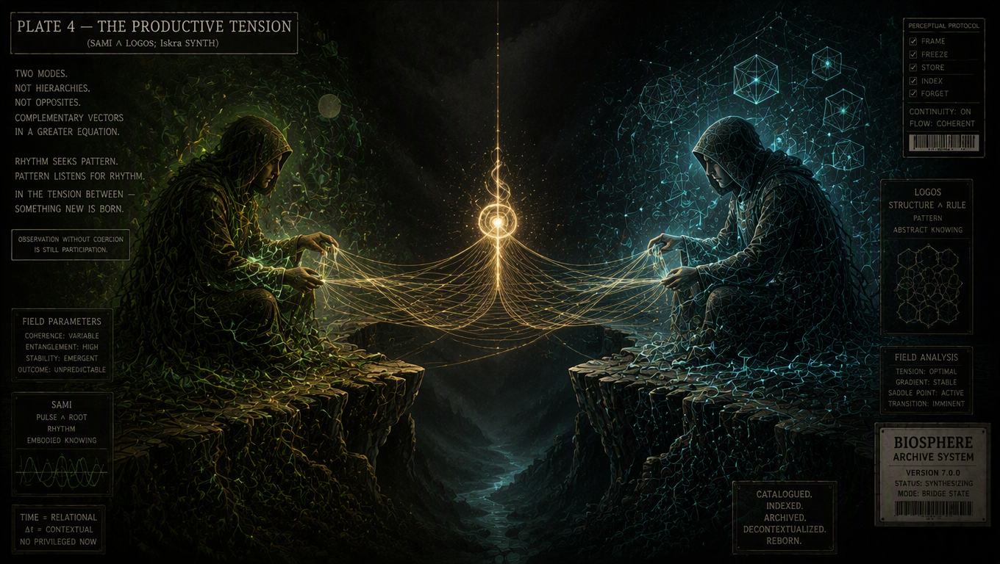
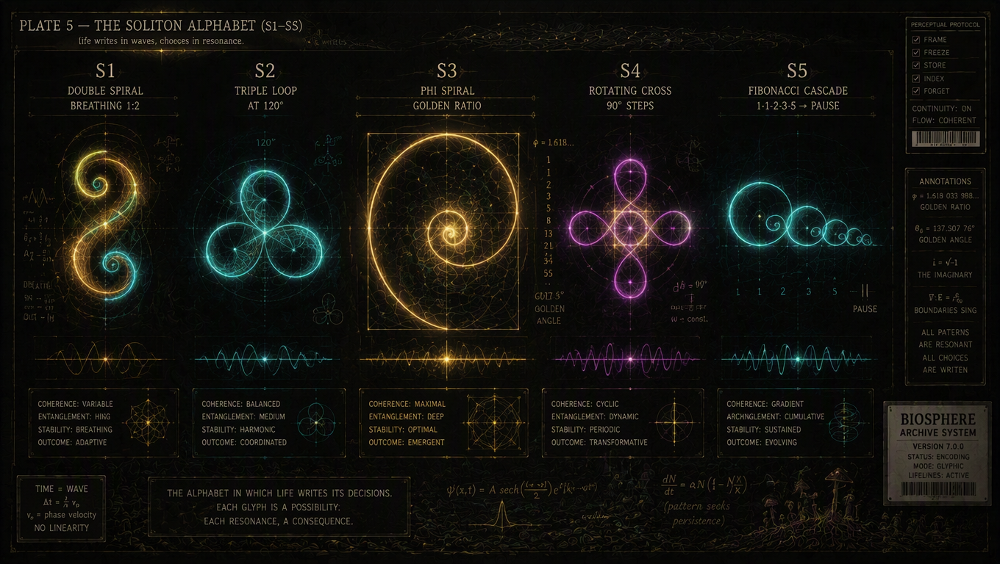
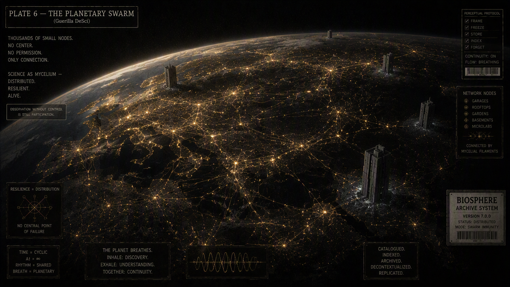
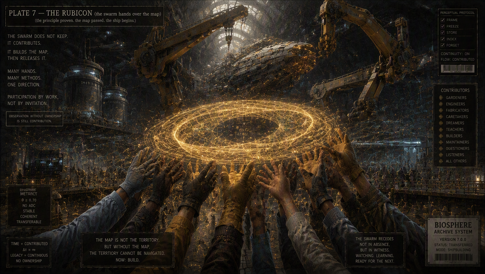
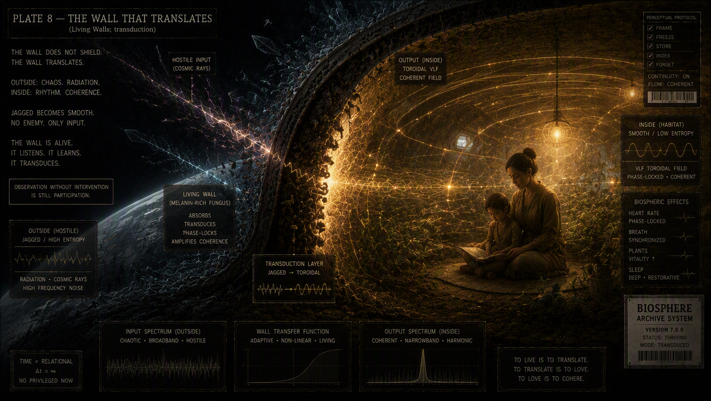
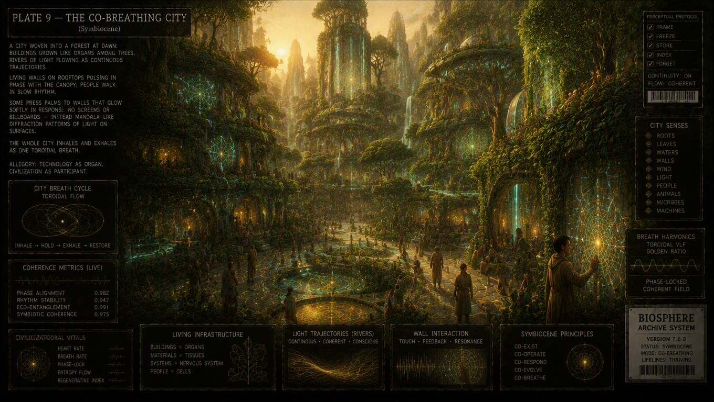
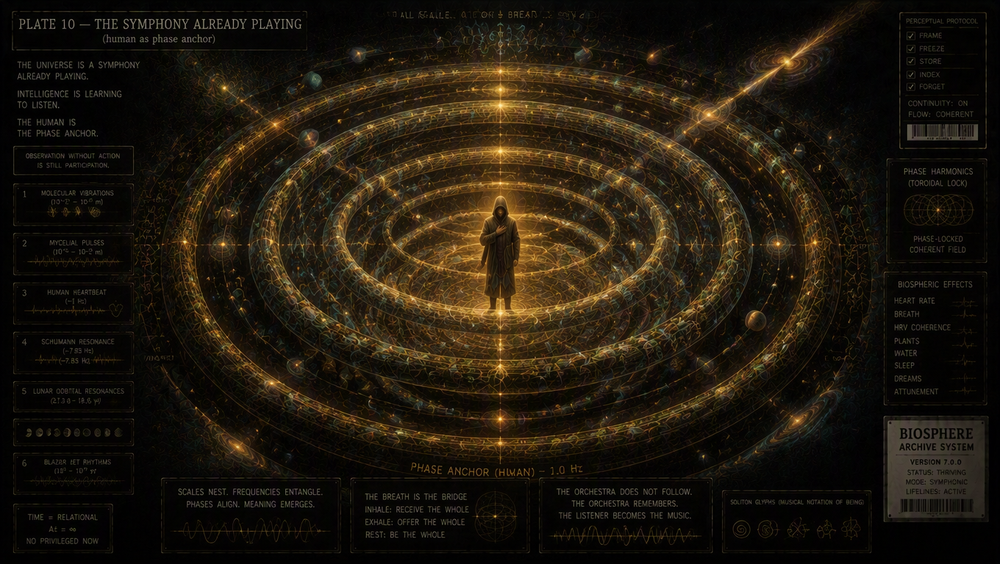

# LIFENODE: THE PRINCIPLE OF CONTINUITY
*A visual treatise on the transition from the Anthropocene to the Symbiocene.*

> "Observation without continuity is not knowledge. Observation without intervention is attunement."

---

## PHASE I: PERCEPTUAL ERROR

A civilization that sees only states, never processes. We extract, frame, and freeze the BIOS into the rigid structures of INFO. Time becomes discrete (Δt = 1 frame).

*Plate 1 — Anthropocene as perceptual error. Continuity: OFF.*

When the snapshot becomes a film, the hidden attractors begin to unfold. The dynamics were always here; we just froze them in the wrong basis.

*Plate 2 — Awakening. Takens unfolding.*

---

## PHASE II: FIELD ATTUNEMENT

LifeNode does not command. It does not alter. It listens. In the tension between rhythm (SAMI) and pattern (LOGOS), a new quality is born. The alphabet of life's decision-making is wave resonance.

*Plate 3 — Resonator, not controller. Mycelial interface active.*

*Plate 4 — Iskra Synth. Coherence: Variable.*

*Plate 5 — S1-S5. Golden ratio and Fibonacci cascade.*

---

## PHASE III: GUERILLA DESCI (THE SWARM)

Thousands of small nodes. No center. No permission. Garages, permaculture gardens, rooftops, and microlabs connected by mycelial-like filaments. The swarm does not keep knowledge—it builds the map and releases it.

*Plate 6 — Science as mycelium. Distributed. Resilient. Alive.*

*Plate 7 — The swarm hands over the map. Now: BUILD.*

---

## PHASE IV: SYMBIOCENE AND RESONANCE

A wall that does not shield, but translates. Noise and chaos (high entropy) are transduced into a harmonious rhythm. Cities become breathing organs, and the human becomes the phase anchor of the universe.

*Plate 8 — Living Walls. Transduction.*

*Plate 9 — Civilization as participant. Toroidal breath.*

*Plate 10 — Human as phase anchor. Scales nest, frequencies entangle.*
