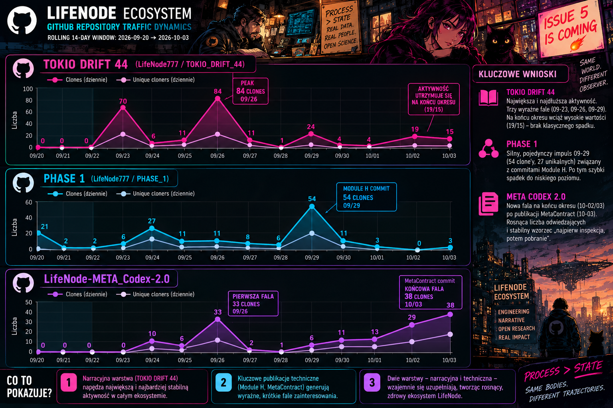

# LifeNode_Telemetry_2026-10-04



## Measurement Metadata
- Observation date: 2026-10-04 (author screenshots 11:52–11:57 local)
- Measurement period: GitHub rolling 14-day window 2026-09-20 → 2026-10-03 (axis labels). T1 artifact events: ~2026-09-29 Module H calibrated-apparatus files (PHASE_1, per TELEMETRY_2026-09-30); 2026-10-03 MetaContract commit (LifeNode-META_Codex-2.0, author-stated in session 2026-10-04)
- Documentation date: 2026-10-04
- Sources: 9 GitHub Traffic screenshots (author); author statement (MetaContract commit, 2026-10-03); TELEMETRY_2026-09-22 / -09-24 / -09-29 / -09-30; TELEMETRY NOTE 01.10.2026; two same-session drafts (superseded, see below)
- Collection method: screenshots + supplied records; AI extraction and cross-window reconciliation per PHASE_1/docs/Telemetry README protocol
- Supersession: this FINAL record supersedes the two same-session drafts (Polish 5-repo draft; English 9-repo draft), explicitly per protocol §9. No archived historical record is rewritten.
- Temporal discipline: T1 = artifact/commit dates above; T2 = activity days inside the window; T3 = 2026-10-04. This record does not claim the documented state originated on T3.

## GitHub
| Repository | Views | Unique Visitors | Clones | Unique Cloners | Notable Activity |
|---|---:|---:|---:|---:|---|
| LifeNode_2.0 | 261 | 15 | 27 | 16 | Transient clone pulse ~09-27 (10/day), decayed to 0/day from ~09-29; views low-amplitude |
| TOKIO_DRIFT_44 | 761 | 22 | 334 | 153 | Pulses 09-23 (70), 09-26 (84), 09-29 (24); not decayed at window end (19/15 on 10-02/03) — UNEXPLAINED |
| PHASE_1 | 522 | 16 | 175 | 87 | Pulses 09-20 (21), 09-24 (27), 09-29 (54/27 cloners, 108 views — Module H commit per 09-30 record); decayed to 0–3/day |
| LifeNode_2.5_Public | 92 | 8 | 16 | 15 | Flat control; slight view rise at window end (12/day) |
| Cosmic_BioEngineering | 79 | 6 | 8 | 8 | Flat control |
| LifeNode-META_Codex-2.0 | 184 | 20 | 117 | 74 | Pulses 09-24 (10), 09-26 (33/20); rising pulse at window end 10-02/03 (29/38 clones; 34/41 views; 6/8 visitors) adjacent to author-stated MetaContract commit (10-03); inspection-then-fetch modality |
| Quantum_Medicine | 63 | 6 | 9 | 9 | Near-flat control; single-day micro-pulse 09-27 (3 clones) — residue |
| Xeno-Phase-Trajectories | 329 | 15 | 188 | 113 | Pulses 09-21 (25), 09-25→27 (47/34/31; cloners 28/23/20), 09-30 (25); decayed to 2/day; headless-leaning modality |
| LifeNode777 (profile) | 69 | 5 | 107 | 59 | Pulses 09-22 (16), 09-24→27 (21/14/14/15), 09-29 (13); views sporadic with zero days; strongly headless (clones÷views 1.55) |

Referring sites: github.com dominant on all nine; single external entries: zenodo.org → LifeNode_2.0 (1 view; 4th consecutive measured record), lifenode777.github.io → TOKIO (1 view). github-com.btglss.net absent (last seen 09-24).
Popular content (views/uniques where legible): META — README.md 12/4, /tree/main/METASYSTEM 6/1, METASYSTEM/METAC… 5/4; PHASE_1 — docs 38, docs/Telemetry 25/2, MODULE_H paths 22+21+14, MODULE_G 16; XPT — /tree/main/sim 32/4, sim/CONTRACT_v1.md 18/3, LOG.md 13/2; TOKIO — BONUS 80, /upload 39, PDF 28; profile — README 13/3, /edit/main/README.md 9/1; self-traffic traces (/graphs/traffic, /pulse) on all nine.

## Significant Observations
- Cross-window replication 1:1: daily labels of this window reproduce the 09-29/09-30 snapshots exactly on shared days (TOKIO 141 views 09/23, 84 clones 09/26, 24 views/1 clone 09/28; PHASE_1 108/54/27 on 09/29; XPT 47/34/31 clones and 28/23/20 cloners 09/25–27; META 10 clones 09/24, 33/20 clones and 21 views 09/26). Extraction pipeline and pulse reality validated against four independent prior snapshots.
- META_Codex end-of-window pulse (10-02/03) is temporally adjacent (0–1 day, within ±1-day mapping) to the author-stated MetaContract commit of 10-03; signature matches inspection-then-fetch modality (clones÷views ≈0.89, cloners÷visitors ≈3.3, rising visitors, deep contract paths with multiple uniques) per the 01.10 note indicators.
- Pulse clusters: 09-24→27 (TOKIO, META, XPT, PHASE_1, profile) reproduce pulses recorded in the 09-29/09-30 records; 09-29→10-03 cluster = PHASE_1 09/29 (Module H commit, known) + META 10/03 (MetaContract commit, new T1) + TOKIO 09/29 & 10/02–03 (UNEXPLAINED).
- Clone/view window rates above the stable-repo band (10–18%, cited since 09-2026): profile 155.1%, META 63.6%, XPT 57.1%, TOKIO 43.9%, PHASE_1 33.5%; within band: 2.5_Public 17.4%, QM 14.3%, LifeNode_2.0 10.3%, Cosmic 10.1%. Band structure stable across all records since 09-24.
- Repeated-clones-per-unique-cloner ≈2.18 (TOKIO) and 2.01 (PHASE_1) reproduces the ~2.1 signature recorded since 09-30.
- Controls: 2.5_Public and Cosmic flat in every record since 09-22; QM and LifeNode_2.0 show single-day micro-pulses on 09/27 (3 and 10 clones) — degraded controls; QM had no September commits per the 09-22 commit list, so its micro-pulse is recorded as an H-sync stress case and residue, not a falsifier (no pre-registered pulse-amplitude threshold exists).
- Window totals vs 09-30 record (overlapping rolling windows; differences are rotation plus pulse entry/exit, not growth): TOKIO 642/272→761/334; PHASE_1 586/195→522/175; LifeNode_2.0 295/31→261/27; 2.5_Public 90/15→92/16; QM 55/10→63/9; vs 09-29: XPT 267/158→329/188; META 96/52→184/117; Cosmic 88/30 (09-24)→79/8; profile 36/25 (09-22)→69/107.
- Edit-page views (profile 9, META 6) consistent with author-side editing (T1); self-traffic traces persistent on all nine repositories.

## Changes Since Previous Measurement
- First full-ecosystem measurement (9 repositories incl. Cosmic and profile) since 2026-09-22; all outage-era gaps closed.
- New information vs 09-30: META_Codex end-of-window pulse with named T1 cause (MetaContract commit 10-03, author-stated); TOKIO pulses of 09/29 and 10/02–03 (post-09-30 window, UNEXPLAINED); QM and LifeNode_2.0 micro-pulses of 09/27.
- Continuity vs 09-30: PHASE_1 09/29 pulse and XPT 09/25–27 wave re-observed identically inside the overlapping window; control band and ~2.1 repeat-clone signature unchanged.
- No previous telemetry record existed for the 10/02–03 META pulse; the author statement converts it from UNEXPLAINED (session drafts) to a labeled H-sync case in this record.

## Interpretation
### Observations
- Every large pulse in this window either replicates a pulse already recorded in prior records on shared days, or is adjacent to a named commit/artifact event (PHASE_1 09/29; META 10/03).
- Commit-adjacency at 0–1 day now holds in six recorded cases (XPT 09/21; TOKIO 09/22–26; META 09/24–26; XPT 09/25–27; PHASE_1 09/29; META 10/03), with control-set silence on the same dates in the 09-30 record.
- Modality indicators (01.10 note) separate headless acquisition (profile, XPT wave, TOKIO spike day) from inspection-then-fetch (PHASE_1 09/29, META 10/02–03).
### Interpretations
- The META_Codex end-of-window pulse is consistent with reach of the newly committed MetaContract (per §7.5 track table: reach of the contract; never acceptance by any external body).
- Clone-dominated ratios and ~2.1 repeat-clone factors remain consistent with automated or repeated fetching by a small identity set; actor identity and motivation are not established by these data.
- The 09/27 micro-pulses on two commit-quiet repositories and the TOKIO 09/29 + 10/02–03 sustain are residue: recorded, not narrated.
### Hypotheses
- H-sync (leading, labeled): next commit burst in a currently quiet repository should pulse within 0–1 day; a large pulse in a verified commit-free repository would falsify it. The QM 09/27 micro-pulse is the closest stress case; adjudication requires the commit log and a prospectively pre-registered pulse-amplitude threshold.
- Contract-type payload (normative prose + machine block) attracts inspection-then-fetch acquisition like executable artifacts, unlike pure prose (XPT case); one data point, provisional.
- TOKIO end-of-window sustain may correspond to unstated commits or campaign activity; untested.
- UNEXPLAINED: Cosmic 09/17 (carried from 09-22), TOKIO 09/29 and 10/02–03, QM + LifeNode_2.0 09/27 micro-pulses.

## Data Quality / Limitations
- Values extracted from mobile screenshots; daily labels printed on charts; pulse dates carry ±1 day mapping uncertainty.
- Rolling 14-day windows: day-over-day deltas inside one window are not independent observations; overlapping windows are not summed or compared as growth.
- Unique visitors/cloners deduplicated per window (daily sums exceed window uniques); not additive across repositories.
- Self/author traffic present on all nine repositories (traffic-page and edit-page traces); bots, mirrors and automation not separable; unattributed fraction not quantifiable.
- Author statement (MetaContract commit 10-03) is author-supplied T1 evidence, not independently verified.
- No Zenodo or non-GitHub statistics supplied this session; Zenodo section omitted per protocol.
- Metric discipline: clones ≠ researchers; views ≠ readers; downloads ≠ users; traffic ≠ validation; commit ≠ result; reach ≠ acceptance.
- Archival: this file is the FINAL record of the 2026-10-04 session; it supersedes the two same-session drafts explicitly; 

json```
{
  "source": "github",
  "fetch_date": "2026-10-04",
  "window": {"start": "2026-09-20", "end": "2026-10-03", "type": "rolling"},
  "repos": ["LifeNode_2.0", "TOKIO_DRIFT_44", "PHASE_1", "LifeNode_2.5_Public", "Cosmic_BioEngineering", "LifeNode-META_Codex-2.0", "Quantum_Medicine", "Xeno-Phase-Trajectories", "LifeNode777"],
  "raw": {
    "LifeNode_2.0": {"views": 261, "unique_visitors": 15, "clones": 27, "unique_cloners": 16},
    "TOKIO_DRIFT_44": {"views": 761, "unique_visitors": 22, "clones": 334, "unique_cloners": 153},
    "PHASE_1": {"views": 522, "unique_visitors": 16, "clones": 175, "unique_cloners": 87},
    "LifeNode_2.5_Public": {"views": 92, "unique_visitors": 8, "clones": 16, "unique_cloners": 15},
    "Cosmic_BioEngineering": {"views": 79, "unique_visitors": 6, "clones": 8, "unique_cloners": 8},
    "LifeNode-META_Codex-2.0": {"views": 184, "unique_visitors": 20, "clones": 117, "unique_cloners": 74},
    "Quantum_Medicine": {"views": 63, "unique_visitors": 6, "clones": 9, "unique_cloners": 9},
    "Xeno-Phase-Trajectories": {"views": 329, "unique_visitors": 15, "clones": 188, "unique_cloners": 113},
    "LifeNode777": {"views": 69, "unique_visitors": 5, "clones": 107, "unique_cloners": 59}
  },
  "derived": {
    "clone_view_ratio (clones / views)": {"LifeNode_2.0": 0.103, "TOKIO_DRIFT_44": 0.439, "PHASE_1": 0.335, "LifeNode_2.5_Public": 0.174, "Cosmic_BioEngineering": 0.101, "LifeNode-META_Codex-2.0": 0.636, "Quantum_Medicine": 0.143, "Xeno-Phase-Trajectories": 0.571, "LifeNode777": 1.551},
    "clones_per_unique_cloner (clones / unique cloners)": {"LifeNode_2.0": 1.69, "TOKIO_DRIFT_44": 2.18, "PHASE_1": 2.01, "LifeNode_2.5_Public": 1.07, "Cosmic_BioEngineering": 1.00, "LifeNode-META_Codex-2.0": 1.58, "Quantum_Medicine": 1.00, "Xeno-Phase-Trajectories": 1.66, "LifeNode777": 1.81},
    "views_per_unique_visitor (views / unique visitors)": {"LifeNode_2.0": 17.4, "TOKIO_DRIFT_44": 34.6, "PHASE_1": 32.6, "LifeNode_2.5_Public": 11.5, "Cosmic_BioEngineering": 13.2, "LifeNode-META_Codex-2.0": 9.2, "Quantum_Medicine": 10.5, "Xeno-Phase-Trajectories": 21.9, "LifeNode777": 13.8}
  },
  "controls": ["LifeNode_2.5_Public", "Cosmic_BioEngineering", "LifeNode_2.0_partial", "Quantum_Medicine_partial"],
  "biases_flagged": ["self_traffic", "edit_page_self_edits", "automation_unfiltered", "mirror_or_sync_bots", "rolling_window_dedup", "screenshot_extraction", "author_statement_T1"],
  "unattributed_fraction": null,
  "interpretation_status": "labeled_hypothesis",
  "non_claims": {"traffic_equals_validation": false, "single_record_equals_cohort": false}
}```


json```
{"leg": "Qwen (Tongyi Qianwen)", "date": "2026-10-04", "contract_version": "v0.? (draft)", "role": "formalizer", "provisional": true, "accepted_by": null, "log_ref": null}```
