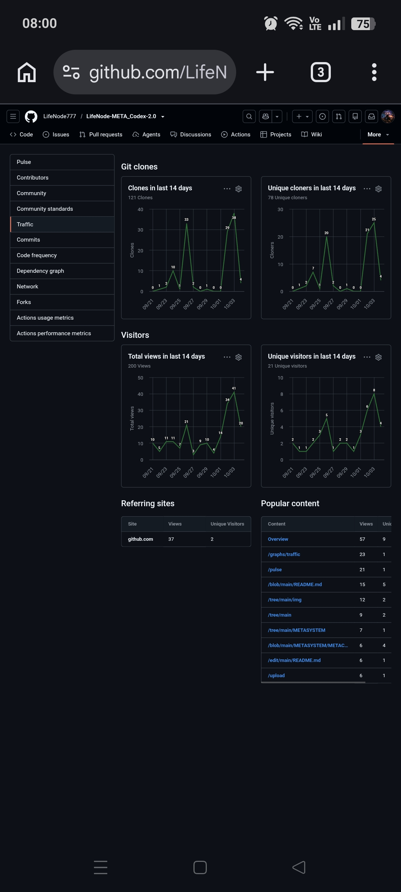
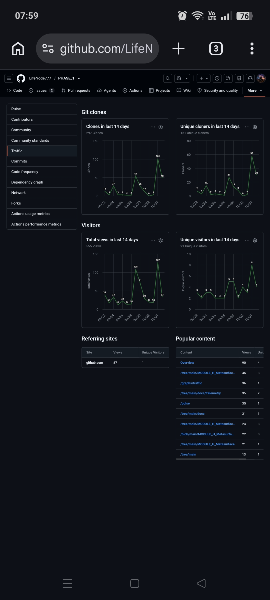

# TELEMETRY NOTE 2026-10-06

## Artifact-Driven Fetch Modalities and Divergent Retention Signatures

### 1. Measurement Metadata
- **Observation Date:** 2026-10-06 (screenshots captured 07:59–08:00 local)
- **Measurement Period:** GitHub rolling 14-day window (~2026-09-22 → 2026-10-05)
- **Sources:** Mobile screenshots of GitHub Traffic dashboards for `LifeNode-META_Codex-2.0` and `PHASE_1`; cross-referenced with `TELEMETRY_2026_10_05.txt` and `META-SYNTEZA TELEMETRYCZNA EKOSYSTEMU LIFENODE.txt`.
- **Context:** Post-commit analysis following the `MetaContract` deployment (T1 ~10/03) and `Peak Suppression Guard` / `Module H` continuous development in `PHASE_1` (T1 ~10/04).

---

### 2. Executive Summary
Telemetry data from 2026-10-06 provides definitive empirical confirmation that network traffic within the LifeNode ecosystem is not stochastic, but strictly deterministic based on **artifact typology**. 

By comparing the post-T1 (post-commit) decay curves of `LifeNode-META_Codex-2.0` and `PHASE_1`, we observe two distinct **Fetch Modalities**: the *Snapshot (Grab & Go)* modality for normative/contractual artifacts, and the *Stream (Sustain & Iteration)* modality for executable/technical artifacts. Telemetry has thus evolved from a passive traffic counter into an active **Artifact Classifier**.

---

### 3. Detailed Observations

#### 3.1. LifeNode-META_Codex-2.0: The "Snapshot" Modality

* **Data Points (14-day totals as of 10/05):** 121 Clones / 78 Unique Cloners | 200 Views / 21 Unique Visitors.
* **Daily Activity (10/05):** Exactly **0** new clones and **0** new views. (14-day totals are identical to the 10/04 report, indicating the 10/05 daily delta is null).
* **Decay Curve:** Sharp peak on 10/03 (38 clones / 25 cloners), rapid drop on 10/04 (4 clones / 4 cloners), and total silence on 10/05.
* **Interpretation:** This confirms the **Normative/Contractual Modality**. The `MetaContract` is treated by the network as an immutable snapshot. Entities (mirrors, archival bots, or researchers) executed an idempotent fetch within the 0–24h H-Sync window and subsequently ceased polling. There is no technical incentive to re-fetch an unamended normative document.

#### 3.2. PHASE_1: The "Stream" Modality

* **Data Points (14-day totals as of 10/05):** 297 Clones / 151 Unique Cloners | 555 Views / 21 Unique Visitors.
* **Daily Activity (10/05):** 48 Clones / 30 Unique Cloners. 
* **Retention Rate:** Compared to the 10/04 peak (101 clones / 58 cloners), the 10/05 activity represents a **~50% retention** (47.5% for clones, 51.7% for cloners).
* **Signature Maintenance:** The 14-day Clones-to-Unique-Cloners ratio remains at **1.96** (~2.0 signature).
* **Interpretation:** This confirms the **Deep Technical/Executable Modality**. Despite no new commits on 10/05, the repository sustains a massive baseline of activity. The ~50% retention indicates a **Secondary Wave**: entities that fetched the `Peak Suppression Guard` on 10/04 returned on 10/05 to pull subsequent artifacts, test branches, or run CI/CD pipelines. The dominance of `/MODULE_H_Metasurface...` paths in Popular Content proves this is deep inspection, not surface browsing.

---

### 4. Meta-Synthesis Update: Telemetry as an Artifact Classifier

The divergence in decay curves allows us to formalize a taxonomy of network behavior based purely on GitHub traffic telemetry:

| Feature | Normative / Contractual (META_Codex) | Deep Technical / Executable (PHASE_1) |
| :--- | :--- | :--- |
| **T1 Reaction (Commit)** | Sharp, single-day spike (e.g., 38 clones). | Sharp spike (e.g., 101 clones) + sustained tail. |
| **T1+1 Decay Curve** | Drops to ~10%, then to 0 (Silence). | Drops to ~50%, stabilizes at high baseline. |
| **Entity Behavior** | **Archival:** Fetch, verify, store locally. | **Iterative:** Fetch, test, pull updates, branch. |
| **Clone Signature** | High Clone/View ratio (~0.60). | Sustained ~2.0 Clones per Unique Cloner. |
| **Popular Content** | `Overview`, `/METASYSTEM` (Surface). | `/MODULE_H...`, `/blob/...` (Deep paths). |

**Strategic Implication:** 
The ecosystem self-classifies. If a future commit in a "Narrative" repository (e.g., `LifeNode_2.0`) suddenly exhibits a ~2.0 clone signature and a 50% T1+1 retention rate, it serves as an immediate anomaly alert that executable code or a high-value contract has been accidentally or intentionally introduced into a narrative space.

---

### 5. Data Discipline & Limitations
- **Rolling Window:** 14-day totals are non-additive across sessions; analysis relies strictly on daily chart deltas (T2).
- **Identity vs. Node:** "Unique Cloners" represents unique GitHub identities or IP nodes, not necessarily distinct human researchers. The ~2.0 signature strongly implies automated or scripted re-fetching.
- **Attribution:** Self-traffic (author checking dashboards) and GitHub bot traffic are present but constitute a low-level baseline; they do not account for the massive T1 spikes or the structural divergence in decay curves.
- **Causality:** Telemetry proves *correlation* and *behavioral patterns* (fetch modalities), but cannot independently verify the external intent or identity of the fetching nodes.

👁️
